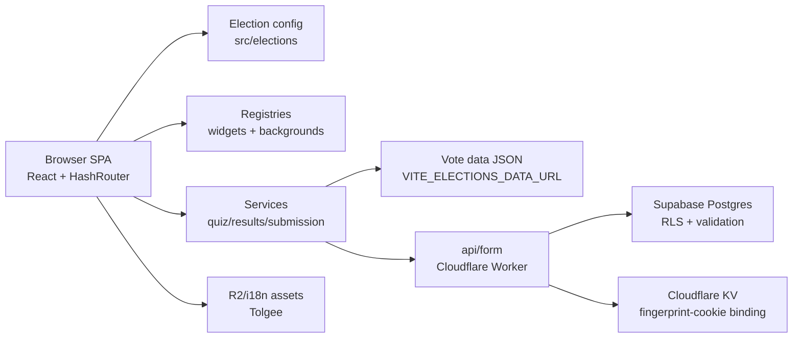

# Architecture

Electometro is a single-page Voting Advice Application. The frontend is a React/Vite app that loads
election configuration and compact vote data, collects voter answers, computes similarity results in
the browser, and optionally submits responses through a serverless API.

## System Overview

## Main Responsibilities

- `src/App.jsx` composes routes and selects the active view.
- `src/elections/` defines election configs and the enabled election registry.
- `src/hooks/useQuiz.js` owns reducer-based quiz state: questions, answers, weights, progress, and
  selected result details.
- `src/contexts/QuizContext.jsx` is a thin **composition root**: it wires together focused hooks (in
  dependency order), adds a few cross-cutting handlers, and exposes one context value consumed via
  `src/contexts/useQuizContext.js`. See [Focused hooks](#focused-hooks) below.
- `src/services/resultsService.js` computes weighted similarity results and partitions entities by
  minimum comparable answers.
- `src/services/submissionService.js` builds and posts submission payloads.
- `src/utils/mnemonicCodec.js` and `src/utils/versionUtils.js` support shareable result URLs and
  version compatibility.
- `src/widgets/registry.js` and `src/backgrounds/registry.js` are extension points.

## Focused hooks

`QuizProvider` composes eight single-responsibility hooks (the result of the architecture refactor —
see [ADR 0002](docs/DECISIONS/0002-architecture-refactor.md)):

| Hook | Responsibility |
| --- | --- |
| `useQuiz` | Reducer-based core state: questions, answers, weights, topic importance, results, selected entity. |
| `useElectionFlow` | Election selection and intro-screen flow. |
| `useQuizNavigation` | Unique-question indexing, skip/back, next-unanswered, mobile detection, menu. |
| `useMinAnswersGate` | Enforces the minimum answered-ratio before results show. |
| `useTopicImportance` | Topic list, "very important" toggles, and weight boosting. |
| `useResultsComputation` | Fetches/caches vote data, runs scoring, partitions results, entity selection, version capture. |
| `useDemographicsAndSubmission` | Demographics, Turnstile/hCaptcha flow, fingerprint, submission. |
| `useMnemonicRestore` | Decodes `?r=` mnemonics, restores state, resolves version mismatches. |
| `useThemeAndAssets` | Applies theme CSS variables, lazy-loads election CSS, persists fingerprint. |

## Data Flow

1. The selected election config provides URLs, labels, branding, result types, and feature flags.
2. `useQuiz` fetches compact vote JSON from `VITE_ELECTIONS_DATA_URL`.
3. The voter answers questions and marks topic importance.
4. Results are computed client-side using weighted absolute-difference similarity.
5. Ties are shuffled within equal-score groups to reduce display-order bias.
6. Entities with fewer than `MIN_COMPARED = 8` comparable answers are partitioned separately.
7. Optional demographics and anti-fraud metadata are submitted to `{BASE_URL}api/form`.
8. The Worker/API boundary persists validated rows to Supabase; database hardening lives in `db/`.

## State Management

- **Canonical quiz data** lives in the `useQuiz` reducer — predictable and serializable, which is what
  makes mnemonic save/restore possible.
- **UI/flow state** is owned by the focused hooks via `useState`, each responsible for one slice.
- **Aggregation** happens in `QuizProvider`, which also holds round/result-type selection and exposes
  everything through one context value.

This keeps the reducer small and pure while distributing side-effectful flow logic into testable,
single-purpose hooks.

## Architecture Evaluation

A pragmatic assessment against common criteria:

- **SOLID** — Strong after the refactor: `QuizProvider` no longer violates SRP and each hook owns one
  responsibility; the registry pattern gives good OCP for elections/widgets/backgrounds. DIP is partial
  — there is no interface over the network layer.
- **Clean Architecture** — Pure logic is separated into `services/`/`utils/` (inner) from `hooks/`/
  `components/` (outer). There is no explicit domain-entity layer; vote/result shapes are object literals.
- **Hexagonal** — Partial: `fetch` lives inside services/hooks rather than behind ports, so the
  data/submission adapter can't yet be swapped for a test double cleanly.
- **Testability** — Pure modules (`resultsService`, `quizService`, `mnemonicCodec`, `versionUtils`,
  `answerMappings`) are highly testable; none are tested yet.
- **Open-source maintainability** — Documentation now exists; the gaps are automated tests, CI, and
  documented submodule contracts.

## Scalability

- The app is static and CDN/edge-friendly; no per-request server work in the frontend.
- Vote data is external JSON, so **data updates don't require redeploys**.
- Scoring is O(entities × questions) client-side; compact payloads (short keys `t1`/`c1`/`p1`) keep
  transfer and compute small.
- Legacy output (`@vitejs/plugin-legacy`, es2018) broadens reach; `react`/`react-dom` split into a
  `vendor` chunk.

## Extension Points

- New election: add a config under `src/elections/` and register it in `src/elections/index.js`.
- New widget: implement a widget type and register it through `src/widgets/registry.js`.
- New background: implement and register through `src/backgrounds/registry.js`.
- Per-election widgets may self-register from an election-specific folder.

## Deployment Boundaries

The tracked repository is primarily the frontend SPA. The API/Worker is represented as an external
submodule (`external/cf-workers`). Vote data, public assets, translations, and Wrangler config may
also be provided through local files or submodules depending on deployment. The exact HTTP/file-layout
contracts for both submodules are documented in [docs/SUBMODULES.md](docs/SUBMODULES.md).

`vite.config.js` currently configures the Cloudflare Vite plugin, `public/index.html`, legacy browser
build targets, and asset nesting under `/electometro/` for Wrangler compatibility. The Cloudflare
health-check workflow mentions considering a DNS migration to Vercel, but Vercel config files are not
tracked in this checkout.

The app uses `HashRouter`, which keeps static hosting and subpath mounting simple.

## Recommended Structural Improvements

### Already Done (recent architecture refactor)

- Decomposed the large `QuizContext` into eight focused hooks (`useQuiz` remains the only quiz hook).
- Normalized file naming and folders per [CONVENTIONS](docs/CONVENTIONS.md); removed the duplicate hook
  and loose root modules.
- Simplified the build to a single platform (Cloudflare), removing the multi-target matrix.
- Documented the `external/*` submodule contracts (Worker API, asset layout, vote-data schema) in
  [docs/SUBMODULES.md](docs/SUBMODULES.md).

### High Impact

- Add Vitest and cover pure services/utilities first.
- Keep deployment secrets out of tracked config files; if Vercel config is reintroduced, inject build
  keys through platform secrets.
- Add CI for lint, build, and tests.
- Keep the repo's `db/` SQL in sync with the datastore schema owned by the private Worker repo, treating
  `db/` as a baseline.

### Medium Impact

- Introduce small data and submission gateway adapters around `fetch`.
- Remove unused server dependencies (`express`, `mongoose`, `cors`, `body-parser`) from the frontend
  manifest, or relocate them to the Worker repo.
- Activate Lefthook with lint and commit-message jobs.

### Low Impact

- Add JSDoc or domain types for vote, result, question, and entity models.
- Reconcile package metadata: license, description, author, homepage, and repository.
- Document `external/*` submodule contracts.

## Specific Gaps

### Naming Inconsistencies

Resolved by the refactor: components are now PascalCase and loose root modules were relocated to
`hooks/`, `utils/`, and `config/` per `docs/CONVENTIONS.md`. Keep new files compliant.

### Folder Organization Issues

Resolved: `src/` no longer mixes entry files with utilities/config/hooks. The `features/` and `shared/`
folders described in `docs/CONVENTIONS.md` are aspirational and not yet used.

### Refactoring Opportunities

`useResultsComputation` is the largest remaining hook; its embedded `fetch` usage (shared with
submission) is the main candidate for an adapter-style boundary.

### Missing Documentation

The project needs stable submodule contracts, release process documentation, and a clearer guide for
adding a full new election dataset.

### Missing Tests

There is no configured test runner. The highest-value first tests are for result scoring, answer
mapping, mnemonic encoding/decoding, version compatibility, and submission payload construction.

### Contributor Onboarding Risks

Local setup depends on untracked/submodule assets and environment files. Without CI and active hooks,
new contributors can miss import, lint, and build regressions until review.
