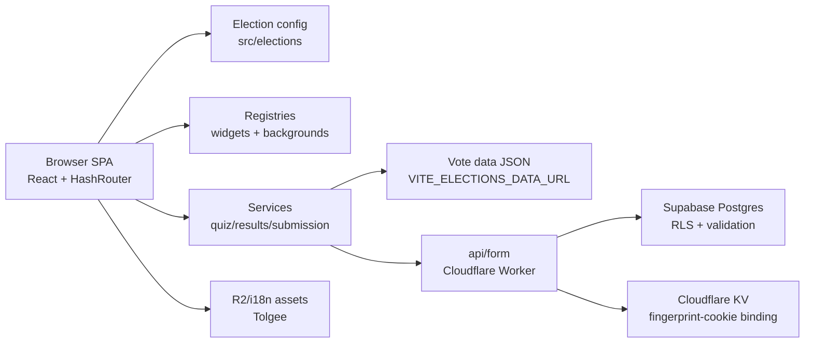

# Architecture

Electometro is a single-page Voting Advice Application. The frontend is a React/Vite app that loads
election configuration and compact vote data, collects voter answers, computes similarity results in
the browser, and optionally submits responses through a serverless API.

## System Overview

## Main Responsibilities

- `src/App.jsx` composes routes and selects the active view.
- `src/elections/` defines election configs and the enabled election registry.
- `src/hooks/useQuiz.js` owns reducer-based quiz state: questions, answers, weights, progress, and
  selected result details.
- `src/contexts/QuizContext.jsx` coordinates election selection, UI flow, fingerprinting,
  demographic submission, result computation, theming, and navigation.
- `src/services/resultsService.js` computes weighted similarity results and partitions entities by
  minimum comparable answers.
- `src/services/submissionService.js` builds and posts submission payloads.
- `src/utils/mnemonicCodec.js` and `src/utils/versionUtils.js` support shareable result URLs and
  version compatibility.
- `src/widgets/registry.js` and `src/backgrounds/registry.js` are extension points.

## Data Flow

1. The selected election config provides URLs, labels, branding, result types, and feature flags.
2. `useQuiz` fetches compact vote JSON from `VITE_ELECTIONS_DATA_URL`.
3. The voter answers questions and marks topic importance.
4. Results are computed client-side using weighted absolute-difference similarity.
5. Ties are shuffled within equal-score groups to reduce display-order bias.
6. Entities with fewer than `MIN_COMPARED = 8` comparable answers are partitioned separately.
7. Optional demographics and anti-fraud metadata are submitted to `{BASE_URL}api/form`.
8. The Worker/API boundary persists validated rows to Supabase; database hardening lives in `db/`.

## State Management

The core quiz reducer is intentionally separate from the larger provider. That gives pure-ish quiz
state transitions a single home, but `QuizContext.jsx` has grown into a broad orchestration module.
It currently mixes flow, submission, fingerprint, analytics, result, and theme responsibilities.

## Extension Points

- New election: add a config under `src/elections/` and register it in `src/elections/index.js`.
- New widget: implement a widget type and register it through `src/widgets/registry.js`.
- New background: implement and register through `src/backgrounds/registry.js`.
- Per-election widgets may self-register from an election-specific folder.

## Deployment Boundaries

The tracked repository is primarily the frontend SPA. The API/Worker is represented as an external
submodule (`external/cf-workers`). Vote data, public assets, translations, and Wrangler config may
also be provided through local files or submodules depending on deployment.

`vite.config.js` currently configures the Cloudflare Vite plugin, `public/index.html`, legacy browser
build targets, and asset nesting under `/electometro/` for Wrangler compatibility. The Cloudflare
health-check workflow mentions considering a DNS migration to Vercel, but Vercel config files are not
tracked in this checkout.

The app uses `HashRouter`, which keeps static hosting and subpath mounting simple.

## Recommended Structural Improvements

### High Impact

- Add Vitest and cover pure services/utilities first.
- Keep deployment secrets out of tracked config files; if Vercel config is reintroduced, inject build
  keys through platform secrets.
- Add CI for lint, build, and tests.
- Keep `src/hooks/useQuiz.js` as the only quiz hook implementation.
- Split `QuizContext.jsx` into focused hooks or providers for submission, fingerprinting, theming,
  result computation, and flow.

### Medium Impact

- Introduce small data and submission gateway adapters around `fetch`.
- Consolidate loose root modules into `hooks/`, `utils/`, and `config/`.
- Normalize component filename casing.
- Activate Lefthook with lint and commit-message jobs.

### Low Impact

- Add JSDoc or domain types for vote, result, question, and entity models.
- Reconcile package metadata: license, description, author, homepage, and repository.
- Document `external/*` submodule contracts.

## Specific Gaps

### Naming Inconsistencies

Legacy lowercase component files and loose root modules conflict with the conventions documented in
`docs/CONVENTIONS.md`.

### Folder Organization Issues

The root of `src/` previously mixed entry files with utilities, config, hooks, and analytics helpers.
Those modules should live under purpose-specific folders.

### Refactoring Opportunities

`QuizContext.jsx` is the main candidate for decomposition. Submission and anti-fraud code are also
good candidates for adapter-style boundaries.

### Missing Documentation

The project needs stable submodule contracts, release process documentation, and a clearer guide for
adding a full new election dataset.

### Missing Tests

There is no configured test runner. The highest-value first tests are for result scoring, answer
mapping, mnemonic encoding/decoding, version compatibility, and submission payload construction.

### Contributor Onboarding Risks

Local setup depends on untracked/submodule assets and environment files. Without CI and active hooks,
new contributors can miss import, lint, and build regressions until review.
